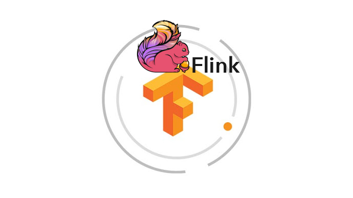

# 实时数据流上的机器学习——Tensorflow on Flink

## 前言

2019年伊始的时候，给自己定下了一个小目标，不用JNI把TensorFlow撸上Flink做实时的预测。把去年放出去的狠话收个尾。

之所以定这个目标，主要是因为在机器学习+流计算的场景有两大诉求：

1. 如何给流计算赋能机器学习，做一些在线的预测（不是训练）？
2. 要是能直接利用训练好的Keras或者Tensorflow模型就更好了嘿嘿嘿……
3. 如何方便的部署？

目前大多的方案还是Flask或者Django写一个Http接口，利用 TensorFlow 原生的 Python API + 某个 Http/RPC Server 作为机器学习中心，然后在流计算中无状态的调用这些接口。

这样做的好处是可以无缝衔接研究者训练好的模型，毕竟大部分的机器学习框架都是Python友好的。但是缺点也很明显：
- 网络IO消耗较大
- 为了适配接口编写代码复杂
- 流计算和机器学习服务集群压力不匹配，单方面处理速度过快导致机器学习服务器侧压力太大但是不能背压
- ……

为了解决这样的问题，我们需要把 Tensorflow 直接嵌入到 JVM 中去，这样的话有好几个方案：

1. 利用原生的 [Tensorflow Java API](https://www.tensorflow.org/api_docs/java/reference/org/tensorflow/package-summary)
2. 把 Python 解释器嵌入JVM
3. 利用 JNI，调用 [C++ API](https://www.tensorflow.org/api_docs/cc/)，完成预测（某种程度和1有点像）
4. 利用 JavaScript Engine 运行 [Tensorflow.js](https://js.tensorflow.org/api/latest/)

本文最终用的是方案4。

先说说几个方案的问题：
1. Java API 官方不保证不稳定是最大的坑，其次部署麻烦，有些glibc不能升级的场景很难部署，更新也很麻烦。
2. 没有找到较好的 Python 解释器的Java库，Jython不能用的，详细原因过长不解释。
3. 依然是glibc等基础库的坑，而且还有在运行中模型不易更新等问题。
4. 也是有坑的，我这一套工具用起来并不是很方便，模型编译出来较大，如果设置不恰当，因为V8引擎的特性，不易使用多核（其实是可以滴）

最后我们的V8依旧是用JNI上的，但是这个库对其他依赖的要求要小很多，基本可以做到是个64位的Linux就可以上（J2V8也支持Windows/Mac/Linux x86/Android等等，但是需要修改POM重新编译）。

## Talk is Cheap

### 1. 用Keras构建一个模型

我这里利用Wine数据集构建了一个简单的模型，详情参见：

https://github.com/TsingJyujing/tf.js-on-flink/blob/master/model/ModelExample.ipynb

这只是一个用于演示的测试模型。

### 2. 将模型编译为js文件

首先找个网站（自己本机搭建也可以），把你的模型放上去，确保通过http可以访问，像这样：

http://fileserver.shinonomelab.com/tof/models/wine/v1.0.0/

随后修改`src/generate_app.js`，把里面的`modelPath`改成你的模型。

最后编译就好啦：`npm run build`，如果你要保留一些调试信息可以用`npm run build-dev`。

编译完成以后，你就可以在target文件夹下看到你的 `ml.bundle.js` 文件，这个就是连库带模型打包到一起的一个文件。

### 3. 编写合适的 `IModel`

我这里仅仅实现了输入输出都是稠密矩阵的函数，参见：`com.github.tsingjyujing.tof.engine.DenseMatrixModel`，因为支持JS的语法，所以你可以把部分的预处理和后处理都放到JS中去，再编写相应的IModel即可。

### 4. 跑吧～

最简单的方式是使用一个RichMapFunction完成预测任务，我给出的例子里，每来10条数据就输出一下正确率，实际的业务场景还有更多玩法，例如把预测错的样本单独输出，这里就不展开了。

详细代码参看这个类：`com.github.tsingjyujing.tof.example.Entry`

### 5. 实时更新

如果你需要在运行中无缝更新你的模型怎么做？可以参考我写的[这篇文章](https://zhuanlan.zhihu.com/p/52007980)。

一般来说，大致就是：

- 配置更新推送到Kafka，然后connect数据流和模型更新流。
- 把你的模型文件和文件版本放到文件服务器上，定期检测更新，检测到更新就重新加载V8引擎
- 或者用配置中心什么的……你们开心就好

## 最佳实践

- 为了最大发挥CPU的效能（如果你的计算需要GPU还是老老实实用Python吧），建议将Flink的TaskManager启动时候的Slot数量设置为CPU的核心数量，如果上面还有其他任务，可以酌情减少。
- 同时，并行化应该配置为全部Slot的个数
- 不建议直接将JS文件放入Kafka中传输，因为实在太大了，建议使用文件服务器
- 在切换Model的时候，先静静的等待新的Model加载好了，然后瞬间换掉老的Model即可。
- 新老Model的切换和使用都必须是同一个Thread！

## 踩过的坑

看上去很简单，但是其实做出这个东西不是一个容易的事情，尤其是前端技术是我的短板的情况下，借助Tensorflow.js就变得尤其痛苦。

放弃了两三次，因为和太多的人吹过水，说能给Flink上TF，所以忍着做完了……

- Webpack 打包问题
- babel问题
- polyfill的兼容性问题
- Nashorn引擎和V8引擎支持语言版本不同的问题
- Webpack打包后函数被包裹住，全局内找不到的问题
- 本地V8不支持访问网络资源的问题
- global对象的问题
- JNI的多线程应用问题
- 还有很多记不清了
